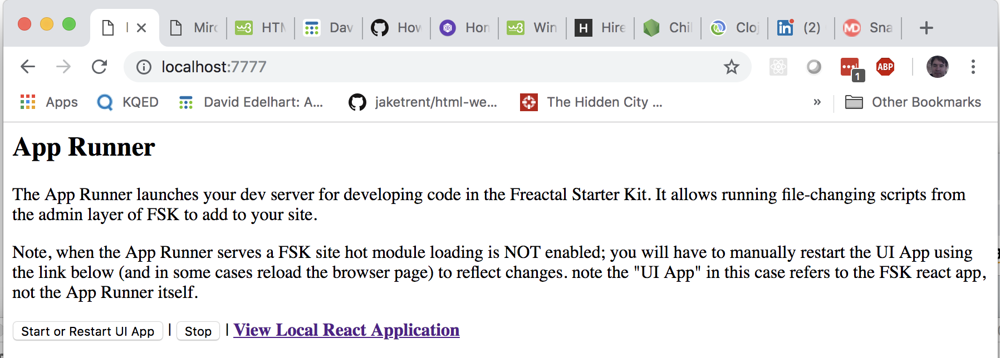

## Admin Mode and the Runner

Tha Admin depends on a small API to execute, as 
it must call file-changing scripts through the KOA "Runner"
api. The runner changes and creates React files, 
mainly through gulp scripts.

In some situations the runner must kill and restart the UI.
Because of this, instead of calling `yarn start` to initialize
the UI, call `yarn runner-start`. This will launch the 
KOA API the admin needs to run, and will start a cluster
process that in turn launches (and in some cases kills and re-launches)
the React development server/Hot Loader.

The React pages that interface with Admin Mode 
are only accessible when a specific environmental
variable, `ADMIN_MODE`, is set. This is done automatically by the Runner.
In other situations, the admin and its utilities should not be visible. 
In any case, in production, the APIs it calls won't be available.

## The Admin Control panel

Open `localhost:7777` on your browser

This is the control panel for the Runner. 

### Stopping Admin Mode

Because of this clustering do not directly kill the
Runner process in the terminal. ***This may leave orphan process threads*** 
that you will have to then kill manually. The child cluster thread does have a 
"heartbeat" that should self-terminate if the parent is killed ... but its
better to manually tell it to shut down then to rely on that.

instead, go to `localhost:7777` which will have on-screen buttons
including one to **stop** the Runner processes, and all their
sub-processes. Use this button to stop Admin Mode. 

If you terminate admin mode (correctly) the admin page will deactivate 
and "freeze up" its control buttons. 

### The React Dev Server in Admin Mode.

Once you boot up in Admin mode, the React dev server
is available on on `localhost:5000`, which is a link on the Admin 
Page mentioned above: **<u>Open React Page</u>**

If you have to make changes that are deeper than Hot Loading can handle
(for instance in the `.neutrinorc` file), use the admin button to
stop and re-launch the React Dev Server. 

## Running out of admin mode

The site should work fine without admin mode - if you don't want to 
use it to admin. `yarn start` will start the hot-loaded React server; 
you just won't have access to the Admin functionality.
