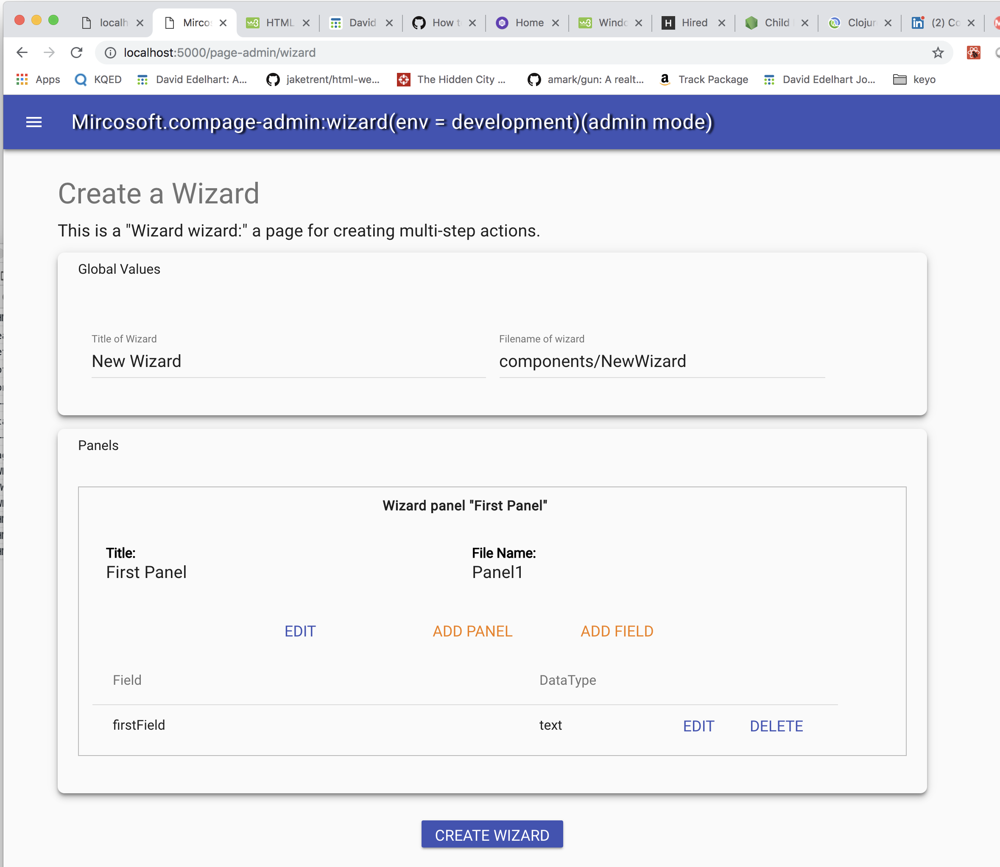

# Wizard Maker

The wizard maker is the first instance of dynamic page creation.
The goal is to make instance sites at least partially self-administering,
and to create a suite of features that allow the pages
to be created (or at least initialized) using an admin frontend.

check RUNNER_README.md for details. 

## The Wizard Interface

The Wizard interface is available under the Admin page:



This allows you to define one or more panels that will comprise the Wizard,
and the Fields that will go into the wizards' state. 

The wizard when created will be written into the path defined by the filename
at the top of the panel. Panels can be moved, renamed, and deleted using this 
interface. 

### Writing the Wizard 

When you write the wizard, it will create source files for the Wizard and each panel
you have defined into the location you have set in the fileName. 
Note this *may be a destructive process* if you have already created the wizard
before, so either git commit your panels and revert them or better yet, only
run the process once and either change the filename of the wizard or 
change the filename of individual panels. 


The wizard will be added to the `src/pageList.json` file and therefore will be
listed in the home page. Remove it or its route if you don't want it there. 
(if you want to embed it on another page or only access it via links). 

### The WizardController

The Wizard uses a WizardController instance to manage navigation; that class
is in the `src/lib/wizard/WizardController` file( and `..WizardControllerPanel`).
That controller is used both by the Admin to create Wizards, and in the runtime
to track data and state for the Wizard. it has a collection of panels that 
track state and values for the panels, and which panel is active 
(via the `index` property of a WizardController instance).

The Wizard and Panel React components are designed to listen to changes to the
controller and manage their navigation from it. 

The WizardController is an emitter; when its values change, it emits a `'changed'`
event with details. 

### The Switch subcomponent

The Switch subcomponent is a dom based equivalent of the JavaScript "switch" 
command - it selects one of its children based on properties. Its designed
to enable the basic mechanic of the wizard; i.e., switching between one of 
the child elements inside it. 

Switch operates in one of two modes. one is "index-based" in which you set 
an index property in it to choose its sub-child to render. 

````javascript

<Switch index={3}>
<Case>1</Case>
<Case>2</Case>
</Switch>

````
Note, index based Switches may be empty (unless you add an "Else" tag to one of the elements).

The other is 
"rule based" in which you pass a subject and define a set of rules for each
element that if true, chooses that element. 

````javascript

<Switch subject={name}>
<Case is={'one'}>1</Case>
<Case is={'two'}>2</Case>
<Case else>3</Case>
</Switch>

````

Subelements of the `Switch` component should be encased with `Case` components, 
but this isn't a requirement; any custom element should work, as long as it has a rule;
index-based picking doesn't require any special properties of the child. 


@TODO: admin pageList with UI. 
